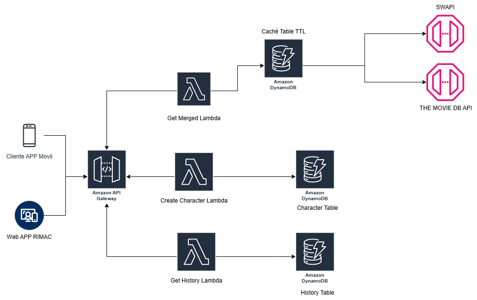
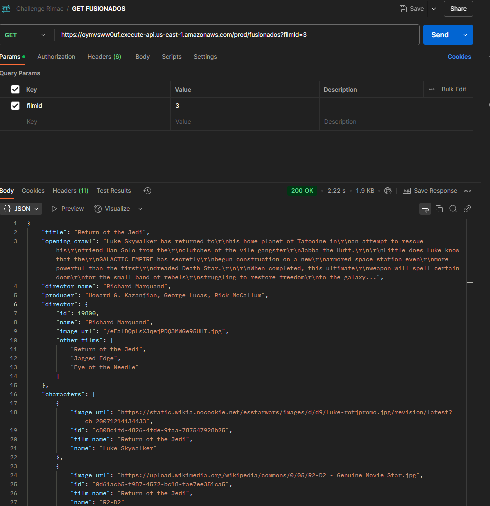
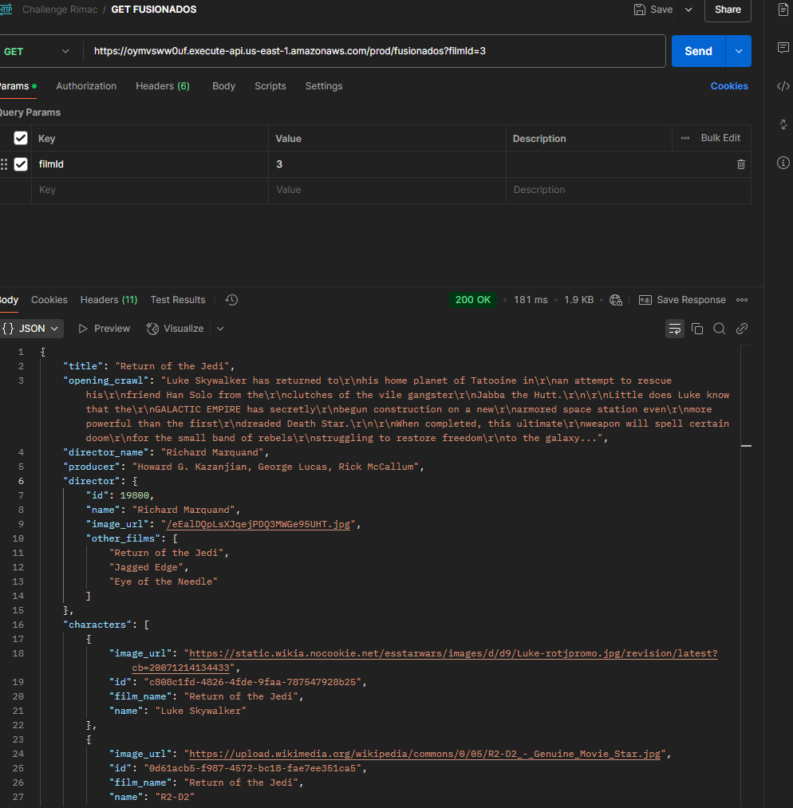
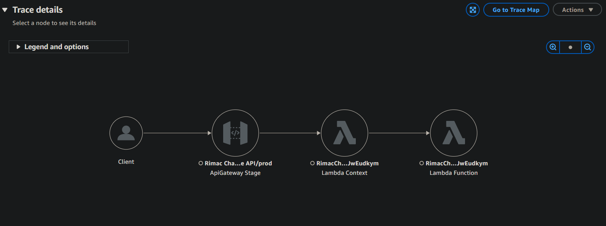

# Backend Nodejs/AWS Challenge 

Se desarrolló el proyecto usando serverless CDK como IaC y servicios de AWS, con integración de dos APIs una publica y otra privada.

## Diagrama de Arquitectura




## Endpoints API GATEWAY


| Operation                                                                               | Type | URI |
|-----------------------------------------------------------------------------------------| ---- | --- |
| Obtene la informacion de dos apis distintas y une la información.                       | GET  | https://oymvsww0uf.execute-api.us-east-1.amazonaws.com/prod/fusionados?filmId=2 |
| Registra una informacion de personajes con data extra a la de swapi en DynamoDB.        | POST  | https://oymvsww0uf.execute-api.us-east-1.amazonaws.com/prod/almacenar |
| Obtiene la un listado del historial de solicitudes del primer endpoint GET /fusionados. | GET  | https://oymvsww0uf.execute-api.us-east-1.amazonaws.com/prod/historial |

## API's Consumidas
* SWAPI - The Star Wars API: https://swapi.dev/documentation
* TMDB - The Movie DB API: https://developer.themoviedb.org/reference/intro/getting-started

## Proceso Caché

Se realizó un sistema de cacheo para las respuestas de las APIs externas, para mejorar el tiempo de respuesta de los endpoints.
Se utilizó una tabla de Dynamo con registro temporales por 30 minutos para manejar el caché.

Evidencias de la mejora y los tiempos de respuesta.

1. Primera solicitud tardó unos ***2.22s***



2. Segunda solicitud tardó unos ***181ms***



# Optimizacion de lambdas

Se uso esbuild https://esbuild.github.io/ para minificar el código de las lambdas, 
así como la arquitectura ***ARM_64***, se seteo el mínimo del timeout para la respuesta de los endpoints.

# Uso de AWS X-Ray

Se configuró la trazabilidad de las peticiones y la integración de los lambdas.




## Comandos Útiles

* Compila Typescript a Javascript
  ```
  npm run build
  ```

* Dejar en modo watching para compilar los cambios
  ```
  npm run watch
  ```
* Ejecuta las pruenas unitarias
  ```
  npm run test
  ```

* Desplegar el stack hacia tu cuenta por defecto AWS account/region
  ```
  npx cdk deploy
  ```

* Comparar la pila implementada con la del estado actual de proyecto
  ```
  npx cdk diff
  ```

* Crea una plantilla de CloudFormation
  ```
  npx cdk synth
  ```