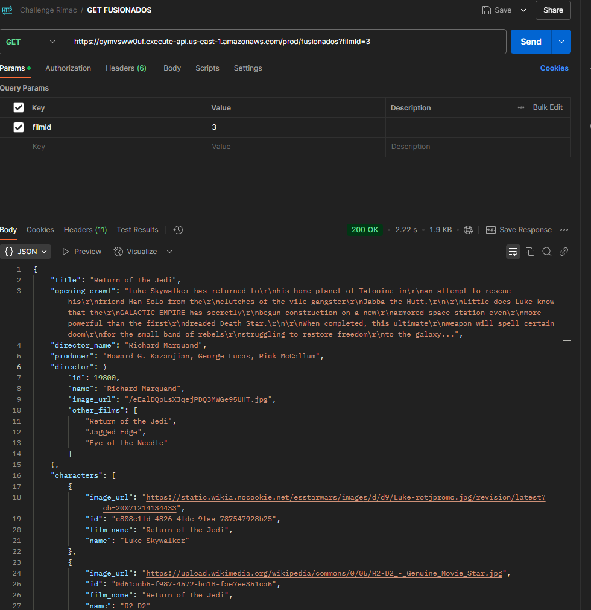
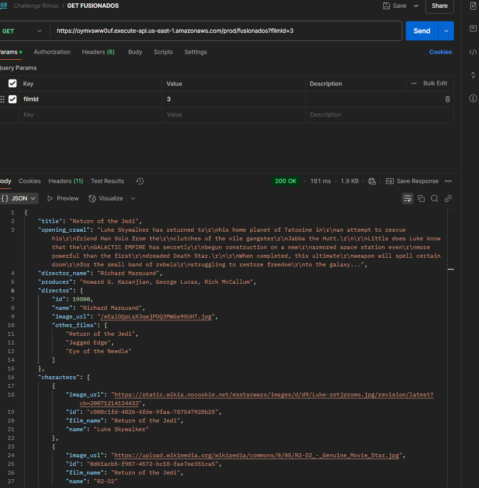

# Backend Nodejs/AWS Challenge 

Se desarrolló el proyecto usando serverless CDK como IaC y servicios de AWS.

## Endpoints

| Operation                                                                               | Type | URI |
|-----------------------------------------------------------------------------------------| ---- | --- |
| Obtene la informacion de dos apis distintas y une la información.                       | GET  | https://oymvsww0uf.execute-api.us-east-1.amazonaws.com/prod/fusionados?filmId=2 |
| Registra una informacion de personajes con data extra a la de swapi en DynamoDB.        | POST  | https://oymvsww0uf.execute-api.us-east-1.amazonaws.com/prod/almacenar |
| Obtiene la un listado del historial de solicitudes del primer endpoint GET /fusionados. | GET  | https://oymvsww0uf.execute-api.us-east-1.amazonaws.com/prod/historial |

## API's Consumidas
* SWAPI - The Star Wars API: https://swapi.dev/documentation
* TMDB - The Movie DB API: https://developer.themoviedb.org/reference/intro/getting-started

## Proceso Caché

Se realizó un sistema de cacheo para las respuestas de las APIs externas, para mejorar el tiempo de respuesta de los endpoints.
Se utilizó una tabla de Dynamo con registro temporales por 30 minutos para manejar el caché.

Evidencias de la mejora y los tiempos de respuesta.

1. Primera solicitud tardó unos ***2.22s***

2. Segunda solicitud tardó unos ***181ms***

## Useful commands

* `npm run build`   compile typescript to js
* `npm run watch`   watch for changes and compile
* `npm run test`    perform the jest unit tests
* `npx cdk deploy`  deploy this stack to your default AWS account/region
* `npx cdk diff`    compare deployed stack with current state
* `npx cdk synth`   emits the synthesized CloudFormation template
